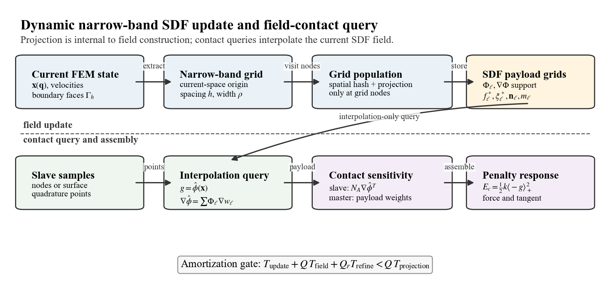

# A FEM-Induced Dynamic Narrow-Band Signed Distance Field with Closest-Feature Sensitivities for Finite-Element Contact

## Abstract

Signed distance fields provide efficient geometric queries for contact, but static SDFs are not directly suitable for deformable finite-element bodies whose surfaces evolve with nodal degrees of freedom. This paper presents a training-free dynamic narrow-band SDF field for FEM contact. At each time step, the current FEM boundary is used to populate a narrow-band signed distance field in the deformed configuration. In addition to distance values, each grid node stores closest-feature payloads, including face identity, barycentric coordinates, and current surface normals. These payloads allow the interpolated SDF field to provide contact gaps, scalar-field normals, and FEM-consistent master-side contact sensitivities. Contact queries are performed by field interpolation; closest-point projection is used only during field construction or optional refinement. We derive the field-based contact Jacobian using the analytic derivative of the scalar trilinear SDF interpolation, assemble frictionless penalty contact forces, and analyze the amortized cost relation between SDF field update and repeated contact queries. Validation reports field accuracy, Eikonal residuals, slave/master Jacobian finite-difference errors, and the crossover query count beyond which the dynamic SDF field outperforms projection-based contact queries.

Keywords: finite element contact; signed distance field; narrow-band method; contact mechanics; closest-feature sensitivity; surface quadrature; computational mechanics

## 1. Introduction

Contact in deformable finite-element simulation requires repeated evaluation of gaps, normals, contact sensitivities, and force contributions on evolving surfaces. Static signed distance fields are attractive for contact because they replace repeated geometric search with local field queries, but a static field does not remain a current-configuration distance field when a finite-element body deforms.

Existing dynamic SDF approaches often use deformation snapshots, reduced bases, learned fields, or other data-driven approximations. Those methods can be effective, but they introduce offline data requirements and may decouple the distance representation from the actual finite-element state. This work instead constructs the SDF directly from the current FEM boundary at each update.

The proposed method builds a current-space narrow-band SDF field from the current boundary surface. A spatial-hash accelerated closest-point projection kernel is used only to populate grid nodes. Once the field exists, contact queries interpolate the field and its closest-feature payload. The method therefore keeps the current-surface geometric consistency of projection methods while making the paper-facing contact query a true field interpolation.

The contributions are:

1. A training-free FEM-induced dynamic narrow-band SDF field built from the current finite-element boundary.
2. Closest-feature grid payloads that store face identity, barycentric coordinates, and normals for FEM-consistent master-side sensitivities.
3. A variationally consistent scalar-field derivative for the slave Jacobian.
4. Field-contact integration backends covering both preserved node-to-surface sampling and surface-to-surface quadrature.
5. An amortized cost model with measured crossover counts showing when field updates pay off over repeated projection queries.

## 2. Related Work

Mesh-based finite-element contact commonly defines normal gap functions through closest-point or mortar projections on the current surface \cite{wriggers2006computational,laursen2002computational}. These formulations provide a direct route to contact sensitivities, but repeated projection at many slave samples can dominate contact-query cost. Our method keeps projection as an internal grid-population kernel and moves repeated queries to a current-space SDF field.

Distance fields and level sets provide a geometric representation in which proximity and normals are queried from a scalar field \cite{osher2003level,frisken2000adaptively,jones2006distance}. They have also been used in collision and contact pipelines in graphics and simulation \cite{bridson2002robust}. In contrast to static distance fields, the field here is rebuilt from the current finite-element boundary and stores closest-feature payloads for master-side sensitivities.

Dynamic collision systems often use spatial subdivision, hashing, or bounding hierarchies to accelerate broad-phase search \cite{teschner2003optimized}. We use spatial hashing only inside field construction; the paper-facing contact query is interpolation of the narrow-band field. Learned implicit fields such as DeepSDF \cite{park2019deepsdf} demonstrate the value of continuous SDF representations, but our setting deliberately avoids snapshots, reduced bases, and neural training so that the distance field remains induced by the current FEM state.

## 3. FEM-Induced Dynamic Narrow-Band SDF Field

Let the current master boundary be a triangulated finite-element surface

\[
\Gamma_h(\mathbf{q}) =
\bigcup_e \mathbf{s}_e(\xi,\eta,\mathbf{q}),
\qquad
\mathbf{s}_e(\xi,\eta,\mathbf{q})
=
\sum_{a\in I_e}N_a^\Gamma(\xi,\eta)\mathbf{x}_a .
\]

At each field update, a Cartesian narrow band \(\mathcal{G}_\rho(\Gamma_h)\) is constructed around the current surface. For each grid node \(\mathbf{y}_\ell\), the field stores

\[
\left(
\Phi_\ell,\,
\mathbf{d}_\ell,\,
f_\ell^\ast,\,
\boldsymbol{\xi}_\ell^\ast,\,
\mathbf{n}_\ell,\,
m_\ell
\right),
\]

where \(\Phi_\ell=\phi_h(\mathbf{y}_\ell,\mathbf{q})\), \(\mathbf{d}_\ell\) is an optional stored gradient or normal estimate, \(f_\ell^\ast\) is the closest surface triangle, \(\boldsymbol{\xi}_\ell^\ast\) are barycentric coordinates on that triangle, \(\mathbf{n}_\ell\) is the current closest-feature normal, and \(m_\ell\) is the narrow-band validity mask. The contact derivative is not defined by interpolating \(\mathbf{d}_\ell\); it is defined as the derivative of the scalar interpolation of \(\Phi_\ell\).

The field update is performed in the deformed configuration whenever the master surface changes for a load step or time step. The current boundary faces are extracted with their deformed vertex positions and oriented normals, and an axis-aligned grid is fitted to the boundary bounding box inflated by the band width \(\rho\). When the solver already knows the slave quadrature or node samples that may query the field, the grid is additionally padded so that every candidate sample has a complete interpolation cell inside the band. Grid nodes outside the band are marked invalid and are never used for contact assembly.



Valid grid nodes are populated by an internal spatial-hash projection kernel. For each valid node, the kernel searches nearby current boundary triangles, computes the signed closest distance, and stores the distance value, closest face id, barycentric coordinates, and closest-feature normal. This projection work is part of \(T_\mathrm{update}\), not part of the repeated query cost. After population, the query path is restricted to trilinear interpolation of \(\Phi_\ell\) and the payload grids. Out-of-band or invalid interpolation cells are rejected rather than silently falling back to projection; projection can reappear only when an explicit refinement mode is requested.

## 4. Field-Interpolated Contact Formulation

For a slave sample point

\[
\mathbf{x}_i^A =
\sum_{b\in I_A} N_b^A \mathbf{x}_b^A ,
\]

the contact gap is the trilinearly interpolated SDF:

\[
g_i =
\hat{\phi}_B(\mathbf{x}_i^A)
=
\sum_{\ell\in\mathcal{C}(\mathbf{x}_i^A)}
w_\ell(\mathbf{x}_i^A)\Phi_\ell .
\]

The spatial derivative used by the slave Jacobian is the analytic derivative of this scalar interpolation:

\[
\nabla_x\hat{\phi}_B(\mathbf{x}_i^A)
=
\sum_{\ell\in\mathcal{C}(\mathbf{x}_i^A)}
\Phi_\ell\,\nabla_x w_\ell(\mathbf{x}_i^A) .
\]

The contact normal is the normalized scalar-field derivative:

\[
\mathbf{n}_i =
\frac{\nabla_x\hat{\phi}_B(\mathbf{x}_i^A)}
{\|\nabla_x\hat{\phi}_B(\mathbf{x}_i^A)\|}.
\]

An interpolated closest-feature normal \(\tilde{\mathbf{n}}_i=\mathrm{normalize}(\sum_\ell w_\ell \mathbf{n}_\ell)\) is retained only as a geometric normal estimate for diagnostics or explicit refinement; it is not the derivative of the scalar gap.

The sign convention is positive for separation and negative for penetration.

The slave Jacobian is

\[
\frac{\partial g_i}{\partial \mathbf{x}_b^A}
=
N_b^A \nabla_x\hat{\phi}_B(\mathbf{x}_i^A)^T .
\]

The master Jacobian is assembled from the interpolated closest-feature payload:

\[
\frac{\partial g_i}{\partial \mathbf{x}_a^B}
=
-
\sum_{\ell\in\mathcal{C}(\mathbf{x}_i^A)}
w_\ell(\mathbf{x}_i^A)
N_a^\Gamma(\boldsymbol{\xi}_\ell^\ast)
\mathbf{n}_\ell^T .
\]

For frictionless normal penalty contact,

\[
E_c =
\frac{1}{2}k\langle -g_i\rangle_+^2,
\qquad
\lambda_i =
k\langle -g_i\rangle_+,
\qquad
\mathbf{f}_{c,i} =
\mathbf{J}_i^T\lambda_i .
\]

A Gauss-Newton contact stiffness approximation is assembled as \(k\mathbf{J}_i^T\mathbf{J}_i\).

## 5. Algorithm and Cost Model

One update/query cycle extracts current boundary triangles, builds \(\mathcal{G}_\rho(\Gamma_h)\), populates grid-node distance and payload values with the projection kernel, evaluates contact samples by interpolation, differentiates the scalar interpolation for slave sensitivities, and assembles field-contact Jacobians and penalty forces.

**Algorithm 1: Current-space dynamic SDF field contact**

**Input:** master nodal positions \(\mathbf{x}^B\), boundary faces \(F^B\), slave samples \(S^A\), spacing \(h\), band width \(\rho\), penalty \(k\).

1. Extract the current master surface \(\Gamma_h^B(\mathbf{q})\) and oriented boundary normals from \((\mathbf{x}^B,F^B)\).
2. Build an inflated current-space grid \(\mathcal{G}_\rho\), including any required padding for candidate slave interpolation cells.
3. Mark grid nodes inside the narrow band; reject nodes outside the validity mask.
4. For each valid node \(\mathbf{y}_\ell\), use the spatial-hash projection kernel to store \(\Phi_\ell\), \(f_\ell^\ast\), \(\boldsymbol{\xi}_\ell^\ast\), \(\mathbf{n}_\ell\), and \(m_\ell\).
5. For each slave sample \(\mathbf{x}_i^A\in S^A\), compute \(g_i=\sum_\ell w_\ell\Phi_\ell\) and \(\nabla_x\hat{\phi}_i=\sum_\ell\Phi_\ell\nabla_x w_\ell\) by interpolation only.
6. If \(g_i<0\), assemble \(J_A=N_A\nabla_x\hat{\phi}_i^T\) and \(J_B=-\sum_\ell w_\ell N^\Gamma(\boldsymbol{\xi}_\ell^\ast)\mathbf{n}_\ell^T\).
7. Accumulate \(\lambda_i=k\langle -g_i\rangle_+\), contact force \(\mathbf{J}_i^T\lambda_i\), optional Gauss--Newton stiffness, and update/query timings.

**Output:** dynamic SDF field, field-contact residuals/Jacobians, and \(T_\mathrm{update}\), \(T_\mathrm{field}\), \(T_\mathrm{refine}\) if refinement is enabled.

The field is beneficial only when the update cost is amortized over enough queries. With optional refinement count \(Q_r\), the measured gate is

\[
T_\mathrm{update}
+
Q T_\mathrm{field}
+
Q_r T_\mathrm{refine}
<
Q T_\mathrm{projection}.
\]

Without refinement,

\[
Q^\ast =
\frac{T_\mathrm{update}}
{T_\mathrm{projection}-T_\mathrm{field}} .
\]

The paper therefore claims acceleration only for query counts exceeding the measured crossover \(Q^\ast\), not for every possible workload.

## 6. Implementation

The field implementation is in `src/sfc/sdf/narrow_band_grid.py` and `src/sfc/sdf/dynamic_narrow_band_sdf.py`. The query API includes `query_phi` and `query_spatial_derivative_phi`; `query_gradient` is the derivative of the scalar \(\phi\) interpolation, while `query_geometric_normal` exposes the optional interpolated closest-feature normal. The field-contact implementation is in `src/sfc/contact/field_contact.py`. It contains a preserved `node_to_surface_field_penalty_response` path for node/sample contact, a reference `surface_to_surface_field_penalty_response` path for triangle quadrature, and a vectorized surface-to-surface response used for the paper-facing CalculiX native-contact comparisons. The older projection path in `src/sfc/sdf/dynamic_surface_sdf.py` is retained as `surface_projection_distance_kernel` for field construction, validation references, and explicitly requested refinement.

The core finite-element mechanics remain internally assembled and independent of Abaqus-generated matrices, force files, `.odb` files, and spreadsheet outputs. No friction, self-contact, nonlinear FEM main method, GPU path, barrier contact, POD, neural SDF, or Abaqus dependency is introduced.

## 7. Experiments

The experiments are organized around the scoped FEM-SDF claims: SDF field accuracy, field-contact Jacobian consistency, multi-step native contact trajectories, three-second C3D8 dynamics, an engineering-style complex contact visualization, and backend/timing ablation.

### 7.1 SDF Field Accuracy

The primary SDF-field outputs are generated by:

```bash
python validation/run_true_dynamic_sdf_field_validation.py --out-dir results/true_sdf_final
```

The experiment uses a deterministic nonplanar triangulated current surface with 512 triangles and three grid spacings. The query path is interpolation-only; projection appears only in field construction and reference/error measurement. All reported gradient and Eikonal quantities use \(\sum_\ell\Phi_\ell\nabla_x w_\ell\), the derivative of the scalar gap interpolation. The paper now uses tables for the three-spacing field accuracy evidence rather than three-point trend figures.

| Parameter | Value |
| --- | --- |
| Current surface | \(z=0.08\sin(\pi x)\sin(\pi y)\) over the unit square |
| Surface discretization | \(16\times16\) cells, 512 boundary triangles |
| Grid spacings | \(h=\{0.100,0.075,0.050\}\) |
| Narrow-band radius and padding | \(\rho=0.25\) |
| Accuracy samples | 72 deterministic near-surface query points |
| Timing samples | 600 deterministic query points, repeated 3 times |
| Material-space sweep | Tilt amplitudes \(a_x=0.02,\ldots,0.12\); tilt-plus-shear uses \(a_y=-0.015,\ldots,-0.09\) with 36 samples per amplitude |
| Projection use | Grid population and reference checks only; field queries use interpolation |

| Spacing | Grid nodes | Valid nodes | Max \(\phi\) error | Max normal error | Max Eikonal residual |
| ---: | ---: | ---: | ---: | ---: | ---: |
| 0.100 | 1792 | 876 | \(1.835893\times10^{-3}\) | \(5.751473\times10^{-2}\) | \(6.784055\times10^{-3}\) |
| 0.075 | 3969 | 2174 | \(1.132281\times10^{-3}\) | \(4.769023\times10^{-2}\) | \(4.546733\times10^{-3}\) |
| 0.050 | 12493 | 7826 | \(5.114950\times10^{-4}\) | \(3.600289\times10^{-2}\) | \(4.743522\times10^{-3}\) |

The material-space sanity check keeps a frozen reference SDF while the current surface is tilted or sheared through an amplitude sweep. The rebuilt current-space field keeps near-zero gap and normal errors across the sweep, while the frozen material field accumulates deformation-induced errors. The paper plots this as error curves rather than a two-case bar chart.

### 7.2 Jacobian Finite-Difference Check

The field-contact Jacobian is checked against finite differences of the same scalar field gap used in the penalty energy. The slave block is compared against finite differences of \(\hat{\phi}(\mathbf{x})\), and the master block is compared against finite differences after rebuilding the field under master nodal perturbations.

| Case | Gap | Slave FD error | Master FD error | Status |
| --- | ---: | ---: | ---: | --- |
| single slave / large triangle | \(-1.30\times10^{-1}\) | \(2.875566\times10^{-11}\) | \(1.462164\times10^{-11}\) | passed |

### 7.3 Quasi-Static Multi-Step Native Contact

Independent CalculiX native contact and SFC dynamic-SDF contact are compared on three benchmark-style quasi-static geometries. Each case uses 21 closure/load steps. CalculiX receives its own `*CONTACT PAIR` model, while SFC independently solves the corresponding `DynamicNarrowBandSDF + field_contact` model.

| Problem | Curve disp. err. | Max strain err. | Max stress err. | Max VM err. | SFC time | CCX time | CCX/SFC |
| --- | ---: | ---: | ---: | ---: | ---: | ---: | ---: |
| sphere indentation | \(2.761745\times10^{-3}\) | \(4.521653\times10^{-2}\) | \(4.346932\times10^{-2}\) | \(4.415077\times10^{-2}\) | 11.137 | 13.633 | 1.224 |
| V-indenter | \(7.056039\times10^{-3}\) | \(6.728597\times10^{-2}\) | \(6.477352\times10^{-2}\) | \(6.297838\times10^{-2}\) | 3.371 | 14.106 | 4.185 |
| cylinder compression | \(4.502934\times10^{-4}\) | \(2.190308\times10^{-3}\) | \(1.723906\times10^{-3}\) | \(1.291308\times10^{-3}\) | 69.291 | 48.107 | 0.694 |

Figure: `paper/numerical_experiments/native_contact_formal_21/figures/native_contact_displacement_curves.png`.

### 7.4 Three-Second C3D8 Free-Fall Settling Contact

The dynamic case uses a deformable C3D8 block released from rest under \(g=9.81\) and settling onto a deformable C3D8 master block through the true field-contact path for three seconds of physical time. Mass-proportional damping dissipates the impact transient so that the latter part of the history remains in sustained contact rather than a brief touch-and-release event. The runner exports 151 time points for \(z\)-displacement, normal force, contact energy, minimum gap, and active contact samples. The fine-grid cloud is taken at the peak normal-force state.

Figures:

- `paper/numerical_experiments/long_time_c3d8_dynamic/figures/long_time_c3d8_dynamic_histories.png`
- `paper/numerical_experiments/long_time_c3d8_dynamic/figures/fine_grid_c3d8_contact_clouds.png`

### 7.5 Fig. 6-Inspired Complex Frictionless Contact

The engineering-style case uses the Fig. 6 loading sketch as geometry/loading inspiration only: a \(20\times10\times2\) mm lower C3D8 block and a \(4.5\times4.5\) mm upper rectangular driver. The driver first applies normal closure and then a lateral offset, but the contact law remains frictionless. The shifted stage uses a \(24\times12\times4\) C3D8 lower mesh, 672 active quadrature samples, and reaches a minimum gap of \(-2.92\times10^{-2}\) mm.

Figures:

- `paper/numerical_experiments/fig6_inspired_frictionless_contact/figures/fig6_inspired_shifted_frictionless_clouds.png`
- `paper/numerical_experiments/fig6_inspired_frictionless_contact/figures/fig6_inspired_sdf_field_visualization.png`

### 7.6 Large-Area Dynamic Surface Contact

The large-area dynamic case tests the amortized field-contact backend under a sustained contact patch rather than a brief impact. A \(10\times10\times2\) C3D8 lower mesh is contacted by a \(10\times10\) prescribed driver surface. The driver ramps into contact and then remains in oscillatory contact, producing 1400 surface quadrature samples per step and 1400 active samples after contact is established. The solver-level comparison uses the complete SFC dynamic solve wall time, not the field-query kernel time alone.

| Case | Active samples | SFC solve (s) | CalculiX solve (s) | CCX/SFC |
| --- | ---: | ---: | ---: | ---: |
| prescribed dynamic surface contact | 1400 | 11.71 | 155.62 | 13.29 |

Backend breakdown for the same SFC run:

| Component | Total time (s) | Mean per step (s) |
| --- | ---: | ---: |
| SDF field update | 4.094 | 0.455 |
| field query/contact assembly | 0.031 | 0.00346 |

The timing claim should use the first table: complete SFC solve time \(11.71\) s versus complete CalculiX native-contact solve time \(155.62\) s. The second table is only a backend breakdown explaining where the SFC time is spent; it must not be presented as the full solver acceleration. The same comparison reports a maximum top-displacement absolute error of \(4.68\times10^{-4}\) and a maximum normal-force relative error of \(1.88\times10^{-1}\), with the largest force mismatch occurring during contact establishment.

Data:

- `paper/numerical_experiments/large_area_dynamic_surface_contact/large_area_dynamic_solver_timing.csv`
- `results/large_area_dynamic_surface_contact_quick_final/large_area_dynamic_comparison.csv`

### 7.7 Backend and Timing Ablation

The field-query crossover is reflected at the step level in contact-dominated TET4/HEX8 static and dynamic tests. The field path is faster in all 16 non-quick rows, with measured projection/field step speedups from \(7.51\times\) to \(24.17\times\). The speedup evidence is plotted against active contact samples so that the amortized SDF-query advantage is visible as query count grows. An 11-step reduced-mesh backend ablation separates node-to-surface sampling, reference surface-to-surface quadrature, vectorized surface-to-surface quadrature, and forced grouped field construction. In this representative run, vectorization preserves endpoint metrics while reducing query/contact cost from 14.58 s to 0.061 s relative to the reference surface-to-surface path.

Figures:

- `results/true_field_solver_timing_formal/figures/solver_step_timing_breakdown.png`
- `results/true_field_solver_timing_formal/figures/solver_step_speedup.png`
- `paper/numerical_experiments/native_contact_backend_ablation_11/figures/backend_ablation_overview.png`

## 8. Scope of Claims

Supported for the reported experiments:

- True dynamic narrow-band SDF field exists.
- Field queries use interpolation only.
- Field accuracy passes the configured thresholds.
- Slave and master field-contact Jacobians pass finite-difference checks.
- SDF acceleration is supported after the measured \(Q^\ast\) crossover.
- The 21-step quasi-static native-contact curves support scoped SFC/CalculiX agreement for the reported geometries.
- The three-second C3D8 dynamic case supports time-history and field-cloud auditability for deformable SDF contact.
- The Fig. 6-inspired case supports engineering-style three-dimensional displacement, strain, stress, gap, pressure, active-mask, and SDF-field visualization, without any stick-slip or friction claim.
- The large-area dynamic comparison supports complete-solver timing for the reported case: SFC \(11.71\) s versus CalculiX native contact \(155.62\) s; field update/query timings are backend breakdowns only.
- Solver-level timing supports the scoped statement that the optimized true-field backend can reduce contact-dominated TET4/HEX8 step time after the measured crossover.
- The backend contains both node-to-surface and surface-to-surface contact integration paths.

Not supported:

- Robust global SDF for arbitrary non-manifold geometry.
- Friction.
- Self-contact.
- Nonlinear FEM as the main method.
- GPU acceleration.
- Barrier contact.
- Superiority over production BVH.
- Abaqus-dependent core solver behavior.

## 9. Supplementary Context

Additional CalculiX, C3D8, SfePy, and external-solver replay results are not the main evidence for this method. They may be retained as supplementary context for external deformed-state checks, but the main paper claims are field construction, field interpolation, field-contact Jacobians, penalty force assembly, native FEM-SDF contact trajectories, and amortized SDF update/query cost.

## 10. Limitations

The field is valid only in the constructed narrow band. Sign handling assumes consistently oriented current surfaces in the tested cases. The current paper-facing implementation targets internally assembled linear finite-element mechanics and frictionless normal penalty contact. Timing results are Python prototype measurements and should not be interpreted as production BVH or hardware acceleration claims.

## 11. Evidence Package

Primary evidence:

- `results/true_sdf_final/field_accuracy.csv`
- `results/true_sdf_final/field_eikonal.csv`
- `results/true_sdf_final/field_contact_jacobian.csv`
- `results/true_sdf_final/field_contact_force.csv`
- `results/true_sdf_final/field_timing_scaling.csv`
- `results/true_sdf_final/field_crossover_scaling.csv`
- `results/true_sdf_final/material_space_vs_dynamic_field.csv`
- `results/true_sdf_final/true_dynamic_sdf_summary.md`
- `paper/numerical_experiments/native_contact_formal_21/native_contact_solver_comparison.csv`
- `paper/numerical_experiments/native_contact_formal_21/native_contact_solver_timing.csv`
- `paper/numerical_experiments/long_time_c3d8_dynamic/long_time_c3d8_dynamic_history.csv`
- `paper/numerical_experiments/fig6_inspired_frictionless_contact/fig6_inspired_frictionless_metrics.csv`
- `results/true_field_solver_timing_formal/solver_step_timing.csv`
- `paper/numerical_experiments/native_contact_backend_ablation_11/backend_ablation.csv`

## Bibliography Status

The manuscript now uses first-pass formal references for FEM contact, level sets, distance fields, spatial hashing, cloth/contact simulation, and learned SDFs. Before submission, the bibliography should still be checked against the target venue's style and expanded with the closest SDF-contact papers for the final related-work positioning.

## Data Availability

The scripts and tabulated numerical data used for the reported validation studies are available from the corresponding author upon reasonable request. A public archival repository can be linked at submission if required by the journal or funding body.

## Declaration of Competing Interest

The authors declare that they have no known competing financial interests or personal relationships that could have appeared to influence the work reported in this paper.

## Funding

This research did not receive any specific grant from funding agencies in the public, commercial, or not-for-profit sectors.

## Declaration of Generative AI and AI-Assisted Technologies in the Manuscript Preparation Process

During the preparation of this work, the authors used OpenAI Codex to support manuscript organization, consistency checks, and language revision. After using this tool, the authors reviewed and edited the content as needed and take full responsibility for the content of the published article.
